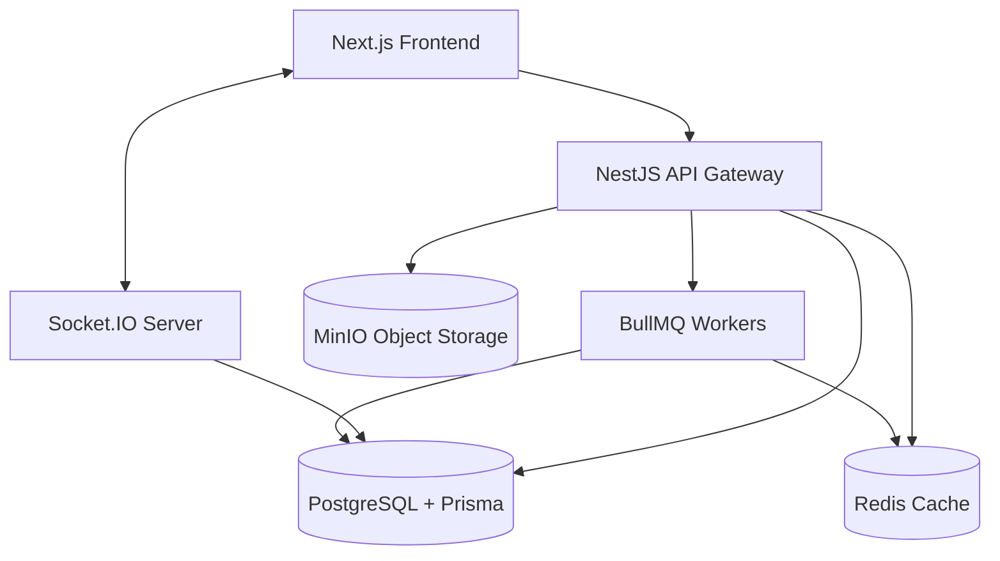

# BidNest MVP

BidNest is a provably fair online bidding platform. Sellers can list items, and users pay a small fee per bid. When the auction ends, a winner is picked using a provably fair random draw based on a cryptographic seed and the hash of all valid bids.

## Architecture



## Setup & Running Locally

This project uses Docker Compose for all infrastructure.

### Prerequisites
- Node.js >= 20
- Docker and Docker Compose

### 1. Environment Variables
Copy `.env.example` to `.env` in both `frontend` and `backend` directories.
```bash
cp frontend/.env.example frontend/.env
cp backend/.env.example backend/.env
```

### 2. Start Infrastructure
Run the following from the root directory to start PostgreSQL, Redis, and MinIO:
```bash
docker-compose up -d
```

### 3. Setup Backend
```bash
cd backend
npm install
npx prisma migrate dev
npm run seed
npm run start:dev
```

### 4. Setup Frontend
```bash
cd frontend
npm install
npm run dev
```

## Provably Fair Draw Verification
Each auction generates a cryptographically secure random `seed` upon creation. A `seedHash` (SHA-256) is published immediately, representing the commitment.

When the auction ends:
1. A `bidsHash` is calculated from the ordered list of valid bids.
2. The winning ticket is calculated as `HMAC-SHA256(seed, auctionId + bidsHash)`.
3. The original `seed` is then revealed.
4. Anyone can use the "Verify Fairness" page on the frontend to input the public `seed`, `auctionId`, and `bidsHash` to independently reproduce the exact winning draw, ensuring the platform did not cheat.
# bid-web-frontend
